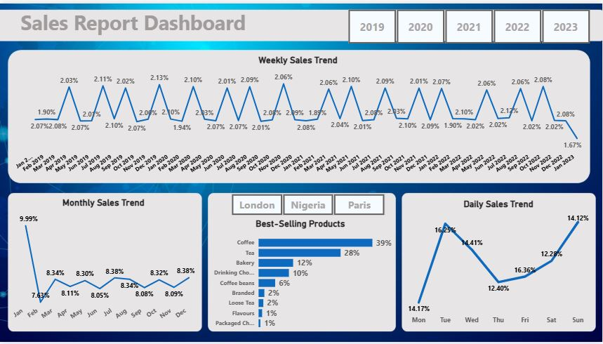

# Automated Sales Reporting with SQL Server & Power BI

## One-Line Takeaway
Automated SQL + Power BI solution that cut sales reporting time by **70%**, delivering real-time insights across product, store, and region performance.

---

## Table of Contents
1. [Business Problem](#business-problem)  
2. [Project Inspiration](#project-inspiration)  
3. [Project Context](#project-context)  
4. [Project Goal](#project-goal)  
5. [Quantified Results](#quantified-results)  
6. [Business Impact](#business-impact)  
7. [How It Helps Stakeholders](#how-it-helps-stakeholders)  
8. [Power BI Dashboard & Insights](#power-bi-dashboard--insights)  
9. [Key Skills Demonstrated](#key-skills-demonstrated)  
10. [Author](#author)  

---

## Business Problem
The organization relied on **manual sales reporting**, which caused delays in decision-making and inconsistent insights.  
Sales managers, executives, and regional teams lacked timely visibility into sales trends across products and regions.

---

## Project Inspiration
I noticed that reporting teams spent hours each week preparing the same daily, weekly, and monthly reports in Excel.  
This inspired me to automate reporting with **SQL Server** and connect it to **Power BI** for self-serve insights.

---

## Project Context
The project uses a **Retail Superstore dataset** containing:  
- Sales transactions  
- Product details  
- Store information  

SQL Server stored procedures were created to automate reporting, and the results were integrated with **Power BI dashboards** for easy access.

---

## Project Goal
- ⏱️ **Save Time** – Reduce reporting turnaround from hours to seconds  
- ⚙️ **Be Flexible** – On-demand **Daily / Weekly / Monthly** summaries  
- 📊 **Deliver Insights** – Track top products, regions, and store performance  

---

## Quantified Results
- 📉 **60–70% reduction** in manual reporting effort  
- ✅ **Consistent & accurate** outputs across departments  
- 🚀 **Real-time insights** available via Power BI dashboards  

---

## Business Impact
**Before:**  
- 6–8 hours weekly spent on manual reporting  
- Risk of errors and inconsistent Excel outputs  

**After:**  
- Automated SQL + Power BI → **instant insights**  
- Consistent reporting across Sales, Finance, and Operations  
- Leaders access **live dashboards** anytime  

---

## How It Helps Stakeholders
- **Sales Managers** → Monitor daily and weekly momentum by product and store  
- **Regional Managers** → Compare store performance across locations  
- **Executives** → Access quick monthly revenue snapshots  
- **Finance & Operations** → Use reliable data for planning and budgeting  

---

## Power BI Dashboard & Insights
The automated SQL outputs power an **interactive Power BI dashboard**, enabling drill-down by date, store, product, and region.

### Key Insights
- **Weekly Trend:** Stable sales with spikes during promotions  
- **Monthly Trend:** Strong January (~9.9%), steady 8–9% thereafter  
- **Top Products:** Coffee (~39%) and Tea (~28%) dominate sales  
- **Daily Pattern:** Mon–Tue peak (>16%), Sunday rebound (~14%)  
- **Regional View:** London, Nigeria, and Paris are leading contributors  

---

## Key Skills Demonstrated
- **SQL Server:** Stored procedures, aggregations, automated reporting  
- **Power BI:** Data modeling, visualization, dashboard design  
- **Business Analysis:** Translating stakeholder needs into analytics solutions  
- **Data Storytelling:** Presenting insights for decision-making  

---

## Author
**Bernard Joseph** — Business Intelligence & Data Analyst  
**Focus:** Automating reporting and delivering decision-ready analytics  
